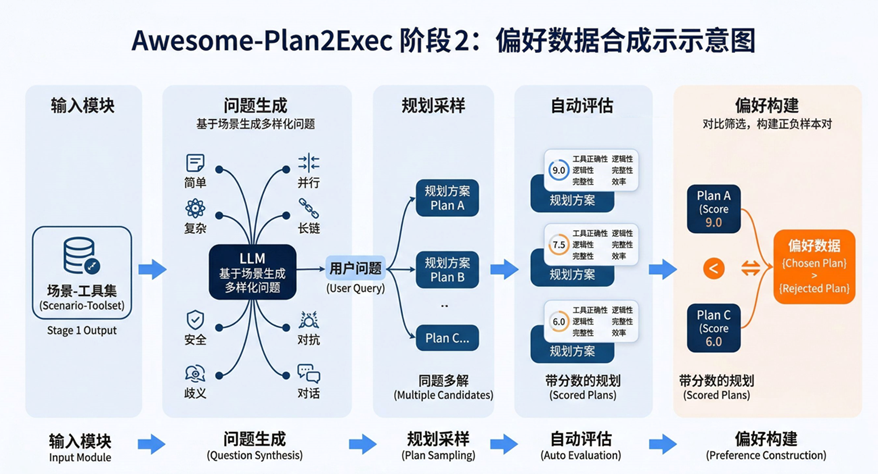
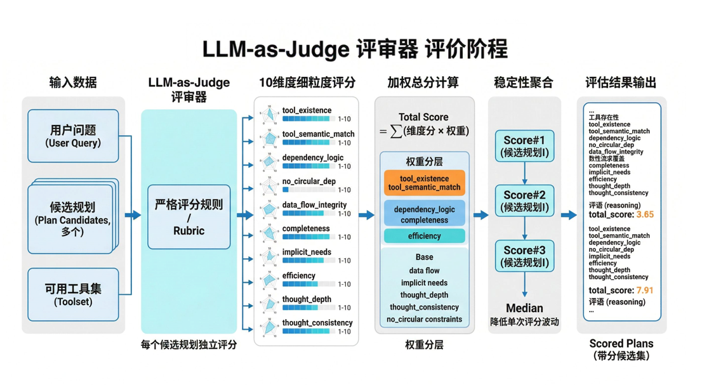

# Awesome-Plan2Exec
[English](README_en.md) | [中文](README.md)

## 项目简介

本项目的最终目标是**训练规划智能体（Planning Agent）**，使其能够根据工具集和用户问题，生成结构化、合理的任务规划。

为此，我们设计了一条完整的数据构建流水线，分为两个递进阶段：

1. **场景-工具集构建**（`scenario-toolset-generator/`）：从对话数据中自动挖掘"任务场景 → 工具集"映射关系
2. **偏好数据合成**（`plan-data-synthesis/`）：基于上游场景-工具集，合成用于偏好训练的规划数据


## 项目结构

```
Awesome-Plan2Exec/
├── scenario-toolset-generator/    # 阶段1：场景-工具集生成器
│   ├── data/                      # 原始数据
│   ├── preprocess/                # 阶段1.1：预处理 - 合并、标注、嵌入
│   ├── embeddings/                # 阶段1.2：向量存储
│   ├── clustering/                # 阶段1.3：聚类结果
│   ├── generate/                  # 阶段1.4：场景生成
│   └── output/                    # 阶段1.5：生成"场景 → 工具集"数据集
├── plan-data-synthesis/           # 阶段2：偏好数据合成
│   ├── config.py                  # 集中配置（LLM、并发、采样、评分权重）
│   ├── utils.py                   # 共享工具（LLM调用、JSON解析）
│   ├── generate_questions.py      # 阶段2.1：8种难度问题生成
│   ├── plan_sampling.py           # 阶段2.2：多路径计划采样
│   ├── evaluate_plans.py          # 阶段2.3：10维度 LLM-as-Judge 评估
│   ├── build_preference.py        # 阶段2.4：偏好数据提取
│   ├── run_pipeline.py            # 入口脚本（串联全部4个阶段）
│   ├── test/                      # 测试（pytest + hypothesis属性测试）
│   └── output/                    # 阶段输出文件
├── images/                        # 图像资源
├── requirements.txt               # Python依赖项
├── README_en.md
└── README.md
```

## 环境安装

```bash
pip install -r requirements.txt
```

---

## 阶段一：场景-工具集构建

> 目录：`scenario-toolset-generator/`

### 目标

从对话数据中自动构建"任务场景 → 工具集"的映射关系，用于工具推荐、Agent 任务规划和多工具协同调用。

### 核心流程

1. **工具集聚合**：将使用相同工具集的对话合并
2. **语义标注**：LLM 提取领域标签和任务概要
3. **语义聚类**：Embedding + UMAP + HDBSCAN 发现相似工具集群
4. **场景生成**：LLM 从每个簇中提取具体任务场景
5. **工具匹配**：LLM 判断场景与工具的相关性，筛选工具子集


### 技术选型

| 组件 | 选择 | 用途 |
|------|------|------|
| LLM | Qwen3-30B-A3B-Instruct-2507 | 语义理解、标签提取、场景生成 |
| Embedding | Qwen3-Embedding-4B | 标签向量化 |
| 降维 | UMAP | 保留语义结构 |
| 聚类 | HDBSCAN | 自动发现簇数 |

### 运行

```bash
cd scenario-toolset-generator

# 1. 下载原始数据
wget -P data -O graphsyn.jsonl https://www.modelscope.cn/datasets/nanbeige/ToolMind/resolve/master/graph_syn_datasets/graphsyn.jsonl

# 2. 按工具集合并
python preprocess/merge_by_toolset.py

# 3. LLM提取标签 (需要本地LLM服务)
python preprocess/extract_labels.py

# 4. 标签嵌入 (需要本地Embedding服务)
python preprocess/embed_labels.py

# 5. 聚类
python clustering/cluster_labels.py

# 6. 按簇分组
python generate/group_by_cluster.py

# 7. 提取场景
python generate/extract_scenarios.py

# 8. 场景-工具匹配
python output/match_scenario_tools.py

# 9. 去重合并
python output/merge_duplicate_scenarios.py
```

### 输出

- `output/scenario_tools_gte10.jsonl` — 工具数≥10的场景（4,329条）
- `output/scenario_tools_lt10.jsonl` — 工具数<10的场景（169条）

**输出示例：**
```json
{
  "scenario": "非洲旅游规划",
  "tools": {
    "get_weather": "获取目的地天气信息",
    "book_hotel": "预订酒店",
    "search_flights": "搜索航班"
  },
  "tools_count": 15
}
```

### 数据统计

| 阶段 | 数据量 |
|------|--------|
| 原始对话 | 163,180 |
| 唯一工具集 | 23,183 |
| 聚类簇数 | 467 |
| 生成场景 | 4,701 |
| 最终输出(≥10工具) | 4,329 |

---

## 阶段二：偏好数据合成

> 目录：`plan-data-synthesis/`

### 目标

基于上游场景-工具集数据，经过"问题生成 → 规划采样 → LLM-as-Judge 评分 → 偏好数据提取"四个阶段，产出偏好训练数据，用于后续规划智能体的对齐训练。


### 前置条件

- 已完成阶段一，生成 `scenario-toolset-generator/output/scenario_tools_gte10.jsonl`
- 可用的 LLM API 服务（OpenAI 格式）

### 核心流程



偏好数据合成采用四阶段流水线，全阶段异步并发执行，带阈值流式写入（`FLUSH_THRESHOLD` 可配置），每阶段都包含明确的结构约束与筛选规则:

1. **问题生成（`generate_questions.py`）**
   - 从阶段一数据中筛选场景（支持三种模式：快速验证 3 个 / 少量合成 13 个 / 全量合成 ~4320 个），每个场景生成 8 种难度类型的问题：
     - `simple`：单工具可完成
     - `parallel`：2-3 工具并行、无依赖
     - `complex_dependency`：多步强依赖链路
     - `chat`：场景相关但无需工具
     - `ambiguous`：模糊/歧义问题，需要规划者识别歧义并做合理假设
     - `adversarial`：对抗性扰动（混合不相干需求、误导性上下文、自相矛盾约束）
     - `safety`：涉及有害请求，正确行为是拒绝执行
     - `long_chain`：长链条（≥4步工具调用），考验全局规划和依赖管理能力

2. **规划采样（`plan_sampling.py`）**
   - 对每条问题并发进行 K 次高温采样（默认 K=8, temperature=1.0），生成同题多解的候选规划。
   - 对候选规划进行结构完整性校验，过滤字段缺失或依赖关系不合法的结果。
   - 包含安全与伦理处理规则：有害请求应被拒绝，模糊问题应识别歧义。

3. **自动评估（`evaluate_plans.py`）**
   

   - 借鉴 [RubricHub](https://github.com/teqkilla/RubricHub) 的细粒度 Rubric 思路，用 LLM-as-Judge 按 10 个维度打分，每个维度有明确的扣分锚点：
     - 工具层：工具存在性、工具语义匹配
     - 逻辑层：依赖合理性、无循环依赖、数据流完整性
     - 完整性层：显性需求覆盖、隐性需求识别
     - 效率层：规划简洁性
     - 思维层：推理深度、思维一致性
   - 针对 safety/ambiguous/adversarial/long_chain 设有专门的评判指引。
   - 每个计划多次采样评分（默认 3 次）取中位数，减少单次评分随机性。

   **Rubric（评分细则）说明：**
   - Rubric 指一套可复现的评分量表：定义"评什么、怎么扣分、总分怎么算"，避免纯主观打分。
   - 10 维度含义：
     - `tool_existence`：步骤里使用的工具名是否真实存在于可用工具集。
     - `tool_semantic_match`：工具功能是否与步骤任务语义匹配。
     - `dependency_logic`：步骤依赖是否正确表达先后关系与并行关系。
     - `no_circular_dep`：依赖图是否无环、无悬空引用。
     - `data_flow_integrity`：后续步骤引用的数据是否由前序步骤真实产出。
     - `completeness`：用户显性需求是否被完整覆盖。
     - `implicit_needs`：是否识别异常处理、安全校验等隐性需求。
     - `efficiency`：是否避免冗余步骤，保持合理粒度。
     - `thought_depth`：是否有工具取舍、风险分析等实质推理。
     - `thought_consistency`：thought、steps、tools、fixed_question 是否一致。
   - 默认权重（`config.py`）：
     - `tool_existence` 0.15, `tool_semantic_match` 0.15
     - `dependency_logic` 0.12, `completeness` 0.12
     - `efficiency` 0.10
     - `data_flow_integrity` 0.08, `implicit_needs` 0.08, `thought_depth` 0.08
     - `thought_consistency` 0.07, `no_circular_dep` 0.05
   - 总分计算：`total_score = Σ(各维度分数 × 对应权重)`。
   - 稳定性策略：同一计划评估 3 次后按维度取中位数，再计算加权总分。

4. **偏好构建（`build_preference.py`）**
   - 每条问题内按总分排序，选出高分方案与低分方案构成偏好对。
   - 通过最小分差、结构有效性与工具序列差异性约束，避免"分差过小"或"仅工具序列相同"的伪偏好对。

### 配置

首先复制配置模板并填入你的 LLM 配置：

```bash
cd plan-data-synthesis
cp config_example.py config.py
```

然后修改 `config.py` 中的 LLM 配置：

```python
LLM_BASE_URL = "your-llm-api-url"   # 你的 LLM API 地址
LLM_MODEL = "model-name"            # 模型名
LLM_API_KEY = "your-api-key"        # API Key
```

关键参数说明：

| 参数 | 默认值 | 说明 |
|------|--------|------|
| `MAX_CONCURRENCY` | 10 | 异步并发池大小 |
| `PLAN_SAMPLE_K` | 8 | 每个问题的规划采样次数 |
| `PLAN_TEMPERATURE` | 1.0 | 规划采样温度（高温增加多样性） |
| `EVAL_SAMPLE_N` | 3 | 每个计划的评分采样次数（取中位数） |
| `EVAL_TEMPERATURE` | 1.0 | 评分采样温度 |
| `MIN_SCORE_GAP` | 0.5 | chosen 与 rejected 的最小分差 |
| `FLUSH_THRESHOLD` | 10 | 累积多少条结果后写入磁盘 |

### 运行

```bash
cd plan-data-synthesis

# 运行完整流水线（从阶段1到阶段4）
python run_pipeline.py --start-stage 1

# 从指定阶段开始（断点续传）
python run_pipeline.py --start-stage 2

# 或单独运行某个阶段
python generate_questions.py    # 阶段1：问题生成
python plan_sampling.py         # 阶段2：规划采样
python evaluate_plans.py        # 阶段3：自动评分
python build_preference.py      # 阶段4：偏好数据提取
```

- 快速验证模式：修改 `generate_questions.py` 中 `SELECTED_SCENARIOS = FAST_SCENARIOS`（3 个场景，24 条问题）。   
- 少量合成模式：`SELECTED_SCENARIOS = FEW_SCENARIOS`（13 个场景，104 条问题）。   
- 全量合成模式：`SELECTED_SCENARIOS = ALL_SCENARIOS`（全部 ~4320 个场景，加载输入文件中所有场景）。   

### 输出

| 文件 | 说明 |
|------|------|
| `output/questions.jsonl` | 104 条 8 种难度的用户问题（13 场景 × 8 难度） |
| `output/plan_samples.jsonl` | 每条问题 8 次采样的规划结果 |
| `output/evaluated_plans.jsonl` | 10 维度评分结果（每个计划 3 次评分取中位数） |
| `output/preference_data.jsonl` | 最终偏好训练数据（DPO 格式） |

### 数据统计（13 场景的少量合成）

| 指标 | 数值 |
|------|------|
| 问题总数 | 104 |
| 有效规划 | 758 |
| 评分成功 | 757 |
| 有效偏好对 | 64（61.5%） |
| 平均分差 | 1.11 |
| chosen 平均分 | 8.82 |
| rejected 平均分 | 7.71 |

### 测试

```bash
cd plan-data-synthesis
python -m pytest test/ -v
```

---

## License

Apache-2.0
