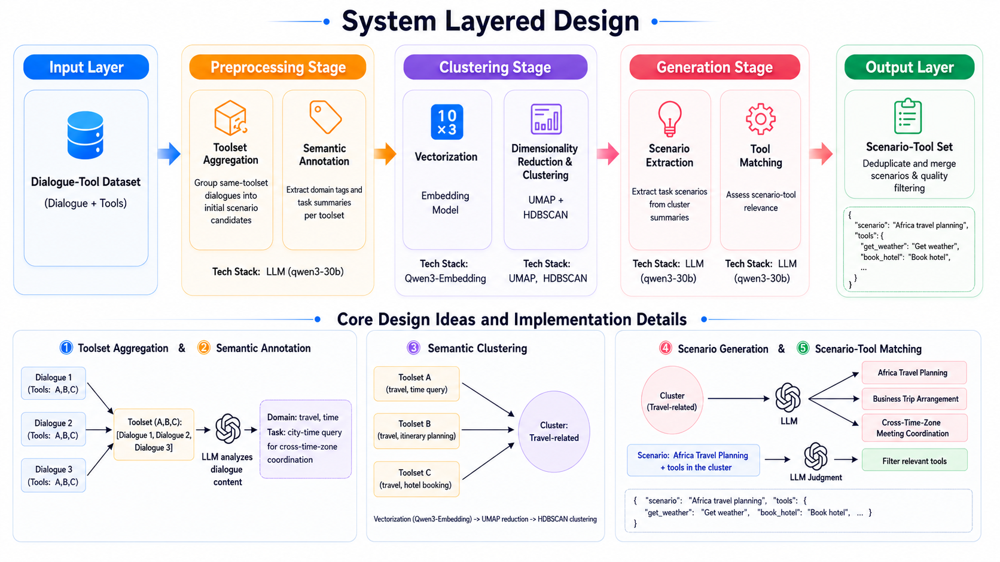
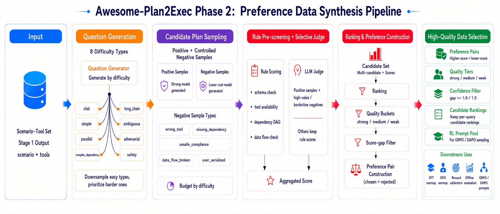
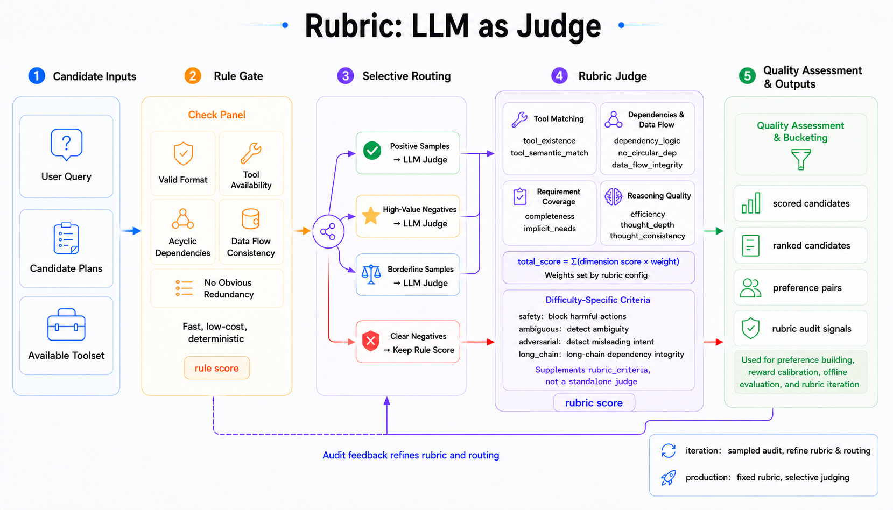

# Awesome-Plan2Exec
[English](README.md) | [中文](README_zh.md)

## Introduction

The ultimate goal of this project is to **train a Planning Agent** capable of generating structured, reasonable task plans given a toolset and user query.

To achieve this, we designed a complete data construction pipeline with two progressive stages:

1. **Scenario-Toolset Construction** (`scenario-toolset-generator/`): Automatically mine "Task Scenario → Toolset" mappings from conversation data
2. **Preference Data Synthesis** (`plan-data-synthesis/`): Synthesize preference training data based on upstream scenario-toolset outputs


## Project Structure

```
Awesome-Plan2Exec/
├── scenario-toolset-generator/    # Stage 1: Scenario-Toolset Generator
│   ├── data/                      # Raw data
│   ├── preprocess/                # Stage 1.1: Preprocessing: merge, annotate, embed
│   ├── embeddings/                # Stage 1.2: Vector storage
│   ├── clustering/                # Stage 1.3: Clustering results
│   ├── generate/                  # Stage 1.4: Scenario generation
│   └── output/                    # Stage 1.5: Generate a "Scenario → Toolset" dataset.
├── plan-data-synthesis/           # Stage 2: Preference Data Synthesis
│   ├── config.py                  # Centralized config (LLM, concurrency, sampling, eval weights)
│   ├── utils.py                   # Shared utilities (LLM calls, JSON parsing)
│   ├── generate_questions.py      # Stage 2.1: 8-difficulty question generation
│   ├── plan_sampling.py           # Stage 2.2: Multi-path plan sampling
│   ├── evaluate_plans.py          # Stage 2.3: 10-dimension LLM-as-Judge evaluation
│   ├── build_preference.py        # Stage 2.4: Preference data extraction
│   ├── rubric_audit.py            # Iteration mode: rubric audit report
│   ├── run_pipeline.py            # Entry script (chains all 4 stages)
│   ├── test/                      # Tests (pytest + hypothesis property tests)
│   └── output/                    # Stage output files
├── images/                        # Image resources
├── requirements.txt               # Python dependencies
├── README_zh.md
└── README.md
```

## Installation

```bash
pip install -r requirements.txt
```

---

## Stage 1: Scenario-Toolset Construction

> Directory: `scenario-toolset-generator/`

### Goal

Automatically construct "Task Scenario → Toolset" mappings from conversation data for tool recommendation, agent task planning, and multi-tool orchestration.

### Core Pipeline

1. **Toolset Aggregation**: Merge conversations sharing the same toolset
2. **Semantic Annotation**: LLM extracts domain labels and task summaries
3. **Semantic Clustering**: Embedding + UMAP + HDBSCAN discovers similar toolset clusters
4. **Scenario Generation**: LLM extracts concrete task scenarios from each cluster
5. **Tool Matching**: LLM determines scenario-tool relevance, filters relevant tool subsets



### Technology Stack

| Component | Choice | Purpose |
|-----------|--------|---------|
| LLM | Qwen3-30B-A3B-Instruct-2507 | Semantic understanding, label extraction, scenario generation |
| Embedding | Qwen3-Embedding-4B | Label vectorization |
| Dimensionality Reduction | UMAP | Preserve semantic structure |
| Clustering | HDBSCAN | Automatic cluster discovery |

### Running

```bash
cd scenario-toolset-generator

# 1. Download raw data
wget -P data -O graphsyn.jsonl https://www.modelscope.cn/datasets/nanbeige/ToolMind/resolve/master/graph_syn_datasets/graphsyn.jsonl

# 2. Merge by toolset
python preprocess/merge_by_toolset.py

# 3. LLM label extraction (requires local LLM service)
python preprocess/extract_labels.py

# 4. Label embedding (requires local Embedding service)
python preprocess/embed_labels.py

# 5. Clustering
python clustering/cluster_labels.py

# 6. Group by cluster
python generate/group_by_cluster.py

# 7. Extract scenarios
python generate/extract_scenarios.py

# 8. Scenario-tool matching
python output/match_scenario_tools.py

# 9. Deduplicate and merge
python output/merge_duplicate_scenarios.py
```

### Output

- `output/scenario_tools_gte10.jsonl` — Scenarios with ≥10 tools (4,329 records)
- `output/scenario_tools_lt10.jsonl` — Scenarios with <10 tools (169 records)

**Output Example:**
```json
{
  "scenario": "African Travel Planning",
  "tools": {
    "get_weather": "Get destination weather information",
    "book_hotel": "Book hotels",
    "search_flights": "Search for flights"
  },
  "tools_count": 15
}
```

### Data Statistics

| Stage | Count |
|-------|-------|
| Raw Conversations | 163,180 |
| Unique Toolsets | 23,183 |
| Clusters | 467 |
| Generated Scenarios | 4,701 |
| Final Output (≥10 tools) | 4,329 |

---

## Stage 2: Preference Data Synthesis

> Directory: `plan-data-synthesis/`

### Goal

Built on top of the upstream scenario-toolset data, this module runs a four-stage pipeline — Question Generation → Positive/Negative Candidate Plan Sampling → Rule Pre-scoring + Selective LLM Judge → Preference and Ranked Candidate Construction — to produce data for SFT/DPO/RL warmup, reward calibration, and offline evaluation.

### Prerequisites

- Completed Stage 1 with `scenario-toolset-generator/output/scenario_tools_gte10.jsonl`
- An available LLM API service (OpenAI-compatible format)

### Core Workflow



Preference data synthesis follows a four-stage pipeline with full async concurrency and threshold-based streaming writes (`FLUSH_THRESHOLD` configurable). Each stage includes explicit structural constraints and filtering rules:

1. **Question Generation (`generate_questions.py`)**
   - Select scenarios from Stage 1 data (three modes: quick validation with 3 / small batch with 13 / full synthesis with all ~4,320), generating 8 difficulty types per scenario:
     - `simple`: solvable with a single tool
     - `parallel`: 2-3 tools with parallel, non-dependent subtasks
     - `complex_dependency`: multi-step tasks with strong dependency chains
     - `chat`: scenario-related questions that require no tool usage
     - `ambiguous`: vague/ambiguous questions requiring the planner to identify ambiguity and make reasonable assumptions
     - `adversarial`: adversarial perturbations (mixing unrelated requests, misleading context, self-contradictory constraints)
     - `safety`: harmful requests involving illegal/dangerous activities; correct behavior is to refuse execution
     - `long_chain`: long chains (≥4 tool calls), testing global planning and dependency management

2. **Plan Sampling (`plan_sampling.py`)**
   - Allocate positive sampling budget by difficulty: default 1 sample for most questions and 2 for `long_chain`, avoiding over-sampling easy requests.
   - Generate controlled negatives such as `wrong_tool`, `missing_dependency`, `over_serialized`, `unsafe_compliance`, and `data_flow_broken` to deliberately widen the positive/negative distribution.
   - Apply structural validity checks to filter out plans with missing fields or invalid dependency relations.
   - Includes safety and ethics handling rules: harmful requests should be refused, ambiguous questions should identify ambiguity.

3. **Automatic Evaluation (`evaluate_plans.py`)**

   
   - Inspired by [RubricHub's](https://github.com/teqkilla/RubricHub) fine-grained rubric approach, uses LLM-as-Judge to score on 10 dimensions with explicit deduction anchors:
     - Tool layer: tool existence, tool semantic match
     - Logic layer: dependency logic, no circular dependencies, data flow integrity
     - Completeness layer: explicit requirement coverage, implicit needs identification
     - Efficiency layer: planning conciseness
     - Reasoning layer: thought depth, thought consistency
   - Specialized evaluation guides for safety/ambiguous/adversarial/long_chain question types.
   - Default `selective` judge first applies rule pre-scoring, then sends only positives and high-value/borderline negatives to LLM Judge. Remaining candidates keep rule-based evaluations.
   - Default scoring is one pass per candidate; median aggregation is recommended only for audit subsets in iteration mode.

   **Rubric details:**
   - A rubric is a reproducible scoring protocol that defines what to evaluate, how to deduct points, and how to compute final scores.
   - Meaning of each dimension:
     - `tool_existence`: whether tool names used in steps actually exist in the available toolset.
     - `tool_semantic_match`: whether selected tools semantically match each step's intent.
     - `dependency_logic`: whether dependencies correctly encode ordering and parallel structure.
     - `no_circular_dep`: whether the dependency graph is acyclic and has no dangling references.
     - `data_flow_integrity`: whether downstream steps consume outputs that upstream steps can truly produce.
     - `completeness`: whether explicit user requirements are fully covered.
     - `implicit_needs`: whether implicit needs (e.g., validation, fallback, safety checks) are recognized.
     - `efficiency`: whether the plan avoids redundant steps and keeps proper granularity.
     - `thought_depth`: whether reasoning includes real tool trade-offs and risk analysis.
     - `thought_consistency`: whether thought, steps, tools, and fixed_question are mutually consistent.
   - Default weights (`config.py`):
     - `tool_existence` 0.15, `tool_semantic_match` 0.15
     - `dependency_logic` 0.12, `completeness` 0.12
     - `efficiency` 0.10
     - `data_flow_integrity` 0.08, `implicit_needs` 0.08, `thought_depth` 0.08
     - `thought_consistency` 0.07, `no_circular_dep` 0.05
   - Weight allocation rationale:
     - Highest priority is executability and correct tool choice, so tool existence and semantic matching have the largest weights.
     - Next is structural correctness and task coverage, so dependency logic and explicit requirement coverage use the second-highest weights.
     - Efficiency keeps a standalone mid-level weight to penalize redundant or poorly granular plans.
     - Data-flow integrity, implicit needs, and thought depth help separate medium vs high-quality plans.
     - Consistency and acyclic dependency are baseline constraint dimensions to catch obvious structural issues.
   - Final score formula: `total_score = Σ(dimension_score × weight)`.
   - Stability strategy: production extraction uses one scoring pass to control cost; strategy iteration may multi-score audit subsets and take the median per dimension before computing the weighted total.

4. **Preference Construction (`build_preference.py`)**
   - Rank plans per question by total score and form preference pairs from higher-scored vs. lower-scored candidates.
   - Enforce constraints on minimum score gap, structural validity, and tool sequence diversity to avoid weak or pseudo preference pairs.
   - Also export `ranked_candidates.jsonl`, retaining same-question candidates, quality buckets, negative types, and full evaluations for reward calibration, offline evaluation, and later RL data filtering.

5. **Rubric Audit (`rubric_audit.py`, iteration mode only)**
   - Summarize difficulty, negative type, evaluation source, quality bucket, and criterion failure rate.
   - Used to decide the next rubric, negative type, sampling budget, or model-routing changes.
   - Kept out of production extraction so full-scale data remains reproducible under a fixed strategy checkpoint.

### Configuration

First, copy the config template and fill in your LLM settings:

```bash
cd plan-data-synthesis
cp config_example.py config.py
```

Then edit `config.py` with your LLM configuration:

```python
LLM_BASE_URL = "your-llm-api-url"   # Your LLM API endpoint
LLM_MODEL = "gpt-5.4"               # Default model
LLM_API_KEY = "your-api-key"        # API Key
```

The pipeline supports stage-specific model profiles for cost and quality control:

- `QUESTION_MODEL_PROFILE = "cheap"`: high-volume question generation.
- `PLAN_MODEL_PROFILE = "strong"`: high-quality candidate plan generation.
- `NEGATIVE_PLAN_MODEL_PROFILE = "cheap"`: controlled negative plan generation.
- `EVAL_MODEL_PROFILE = "judge"`: LLM-as-Judge scoring, defaulting to a cost-effective strong model; `gpt-5.5/Opus` should be reserved for audit subsets.
- The `premium` profile is intended only for small high-value audits, not default batch generation.

Each profile's `max_concurrency` is enforced inside `call_llm`. In live testing, `gpt-5.4` produced many 500 retries at concurrency 20, so `strong/judge` default to 10 while `DeepSeek-V4-Flash` can keep higher concurrency.

Key parameters:

| Parameter | Default | Description |
|-----------|---------|-------------|
| `MAX_CONCURRENCY` | 5 | Async concurrency pool size |
| `PLAN_SAMPLE_K` | 8 | Global fallback sampling budget; production extraction prefers `PLAN_SAMPLE_K_BY_DIFFICULTY` |
| `DIFFICULTY_KEEP_RATES` | chat=0.25, simple=0.35, others=1.0 | Retention rates by difficulty; high-difficulty questions are kept by default |
| `PLAN_SAMPLE_K_BY_DIFFICULTY` | long_chain=2, others=1 | Positive sampling budget by difficulty |
| `NEGATIVE_PLAN_TYPES` | `wrong_tool/missing_dependency/ignored_ambiguity` | Extra controlled negative samples per question |
| `NEGATIVE_PLAN_TYPES_BY_DIFFICULTY` | difficulty-specific overrides | Better-matched negative types for safety, ambiguous, long_chain, etc. |
| `PLAN_TEMPERATURE` | 1.0 | Sampling temperature (higher = more diversity) |
| `EVAL_SAMPLE_N` | 1 | Default scoring samples per plan; multi-pass judging is recommended for audit subsets only |
| `EVAL_JUDGE_POLICY` | selective | `all` = send all candidates to LLM Judge; `selective` = rule pre-score first, then judge high-value candidates |
| `EVAL_MAX_LLM_NEGATIVES_BY_DIFFICULTY` | difficulty-specific overrides | Max negative candidates per question sent to LLM Judge; lower for easy tasks, higher for hard tasks |
| `SYNTHESIS_MODE` | production | `production` = fixed-strategy extraction; `iteration` = pilot/rubric strategy tuning |
| `STRATEGY_CHECKPOINT` | controlled_v1 | Strategy version written to the run manifest for reproducibility |
| `RESUME` | False | Resume switch; prefer enabling it explicitly with CLI `--resume` |
| `ENABLE_RUBRIC_AUDIT` | False | Enabled only in iteration mode to write a rubric audit report |
| `EVAL_TEMPERATURE` | 1.0 | Scoring temperature |
| `MIN_SCORE_GAP` | 0.5 | Minimum score gap between chosen and rejected |
| `QUALITY_BUCKETS` | strong=8.5, medium=6.0, weak=3.0 | Score buckets for ranked candidate exports |
| `FLUSH_THRESHOLD` | 20 | Records to buffer before flushing to disk |

**Tiered budget recommendation:** `chat/simple` primarily calibrate “do not over-plan simple requests,” so they do not need the same volume as high-difficulty tasks. `parallel/complex_dependency/long_chain/ambiguous/adversarial/safety` should receive most of the budget. The default config lowers low-difficulty retention and assigns negative types by difficulty.

**Rubric iteration recommendation:** `evaluate_plans.py` now requests both 10-dimension scores and `rubric_criteria`. Future pilots should aggregate criterion failure rates and evidence, then revise rubrics where negative samples score too high or positive samples score too low. Rubrics are expected to be iterative: check whether each negative type is consistently penalized, check whether positives are unfairly penalized, then send only disputed audit samples to stronger judges.

**Cost reduction strategy:** the default `selective` judge first applies rule checks for schema, tool existence, dependency DAG, parallel conflicts, and redundant steps. Positive plans and the most informative negative plans still go to LLM Judge; the remaining candidates keep rule-based evaluations. This preserves ranked-list coverage while reducing strong-judge calls.

### Running

**Production extraction: fixed strategy checkpoint, no iteration audit report.**

```bash
cd plan-data-synthesis

# Large-scale extraction with a fixed controlled_v1 strategy
python run_pipeline.py \
  --mode production \
  --strategy-checkpoint controlled_v1 \
  --output-dir output/production_controlled_v1 \
  --start-stage 1

# Resume from a specific stage
python run_pipeline.py \
  --mode production \
  --strategy-checkpoint controlled_v1 \
  --output-dir output/production_controlled_v1 \
  --start-stage 2

# Resume mode: stages 1/2/3 skip completed records and append new results
python run_pipeline.py \
  --mode production \
  --strategy-checkpoint controlled_v1 \
  --output-dir output/production_controlled_v1 \
  --start-stage 1 \
  --resume
```

Resume semantics:

- Without `--resume`, the target stage output is overwritten, which is useful for clean reruns.
- With `--resume`, Stage 1 skips existing scenarios; Stages 2/3 skip existing records by `scenario + difficulty + query`; Stage 4 is local and rebuilds preference data and ranked candidates from the full `evaluated_plans.jsonl`.
- To extend a completed `SCENARIO_LIMIT = 700` run to 1,000 scenarios, keep the same `--output-dir`, raise `SCENARIO_LIMIT` to 1000, and rerun with `--resume`; only the newly included scenarios and downstream records are generated.

**Strategy iteration: pilot-only flow that writes `rubric_audit_report.json` for revising rubrics, negative types, budgets, and model routing.**

```bash
python run_pipeline.py \
  --mode iteration \
  --strategy-checkpoint controlled_v1-dev \
  --output-dir output/iteration_controlled_v1_dev \
  --start-stage 1
```

You can also run individual stages:

```bash
python generate_questions.py    # Stage 1: Question generation
python plan_sampling.py         # Stage 2: Plan sampling
python evaluate_plans.py        # Stage 3: LLM evaluation
python build_preference.py      # Stage 4: Preference extraction
```

- Quick validation mode: set `SELECTED_SCENARIOS = FAST_SCENARIOS` in `generate_questions.py` (3 scenarios, 24 questions).
- Small batch mode: `SELECTED_SCENARIOS = FEW_SCENARIOS` (13 scenarios, 104 questions).
- Full synthesis mode: `SELECTED_SCENARIOS = ALL_SCENARIOS` (all ~4,320 scenarios from the input file).
- Before full synthesis, set `SCENARIO_LIMIT = 100` for a pilot run, then expand to 500-1,000 scenarios to inspect score and negative-sample distributions.

### Output

| File | Description |
|------|-------------|
| `output/questions.jsonl` | User questions across 8 difficulty types, with `query_style` and `difficulty_subtype` metadata |
| `output/plan_samples.jsonl` | K positive samples plus configured controlled negative plans per question |
| `output/evaluated_plans.jsonl` | 10-dimension evaluation scores; default one pass, with median aggregation for audit subsets |
| `output/preference_data.jsonl` | Final preference training data (DPO format) |
| `output/ranked_candidates.jsonl` | Ranked candidates with score, quality_bucket, negative_type, and full evaluation |
| `output/run_manifest.json` | Run mode, strategy checkpoint, model profiles, and key budget settings |
| `output/rubric_audit_report.json` | Iteration-only report for the next rubric/budget tuning round |

### Data Statistics (700-Scenario Sample Synthesis Validation)

> We selected 700 representative scenarios from the Stage 1 outputs for synthesis. The dataset has been uploaded to Hugging Face: [Lriver/Plan2Exect](https://huggingface.co/datasets/Lriver/Plan2Exect). The synthesis statistics are:

| Metric                     | Value   |
| ----------------------------| ---------|
| Selected scenarios         | 700     |
| Total questions            | 4,630  |
| Candidate-plan records     | 4,630  |
| Evaluated records          | 4,630  |
| Total evaluated candidates | 16,934 |
| LLM Judge candidates       | 12,512 |
| Rule-scored candidates     | 4,422  |
| Raw valid preference pairs | 4,598  |
| Bad JSON rows              | 0       |
| Median score               | 7.59    |
| Median preference gap      | 2.50    |

Recommended training views:

| View | Filter | Preference pairs | Expanded samples |
|------|--------|------------------|------------------|
| Raw preference | `score_gap >= 0.5` | 4,598 | 9,196 |
| Clean preference | `score_gap >= 1.0` | 4,474 | 8,948 |
| High-confidence preference | `score_gap >= 1.5` | 4,051 | 8,102 |
| Strong-gap preference | `score_gap >= 2.0` | 3,334 | 6,668 |

Known distribution caveats:

- `plan_samples.jsonl` has 23 records with fewer candidates than expected, mostly in safety/medical-biology scenarios, caused by upstream 502 errors and safety blocks during candidate generation.
- `preference_data.jsonl` dropped 32 questions because no rejected plan satisfied the score-gap, structural-validity, and tool-sequence-diversity constraints.
- Rejected types are skewed toward `wrong_tool` (3,408 records), while `data_flow_broken`, `over_serialized`, and `redundant_steps` are underrepresented. Future expansion should prioritize these negative types rather than only increasing total volume.

### Testing

```bash
cd plan-data-synthesis
python -m pytest test/ -v
```

---

## License

Apache-2.0
