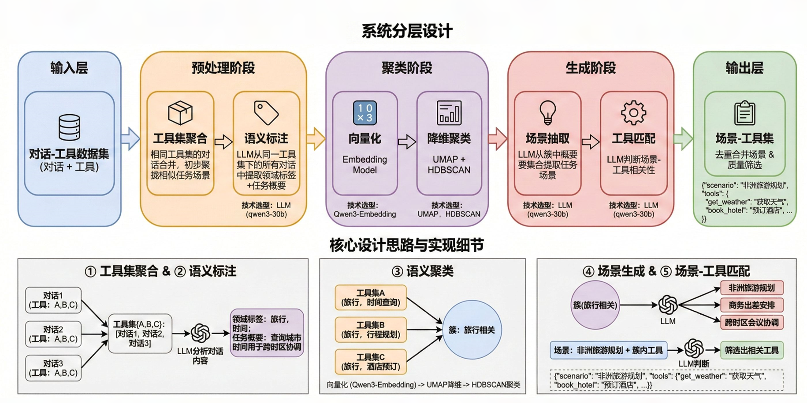

# Awesome-Plan2Exec
[English](README_en.md) | [中文](README.md)   
Scenario-Toolset Data Construction for Agent Planning and Execution

## Introduction

This project automatically constructs "Task Scenario → Toolset" mappings from conversation data, enabling:
- Tool recommendation
- Agent task planning
- Multi-tool orchestration

**Output Example:**
```json
{
  "scenario": "African Travel Planning",
  "tools": {
    "get_weather": "Get destination weather information",
    "book_hotel": "Book hotels",
    "search_flights": "Search for flights",
    ...
  },
  "tools_count": 15
}
```

---

## System Architecture



### Core Pipeline

1. **Toolset Aggregation**: Merge conversations sharing the same toolset
2. **Semantic Annotation**: LLM extracts domain labels and task summaries
3. **Semantic Clustering**: Embedding + UMAP + HDBSCAN discovers similar toolset clusters
4. **Scenario Generation**: LLM extracts concrete task scenarios from each cluster
5. **Tool Matching**: LLM determines scenario-tool relevance, filters relevant tool subsets

### Technology Stack

| Component | Choice | Purpose |
|-----------|--------|---------|
| LLM | Qwen3-30B | Semantic understanding, label extraction, scenario generation |
| Embedding | Qwen3-Embedding-4B | Label vectorization |
| Dimensionality Reduction | UMAP | Preserve semantic structure |
| Clustering | HDBSCAN | Automatic cluster discovery |

---

## Project Structure

```
Awesome-Plan2Exec/
├── scenario-toolset-generator/    # Scenario-Toolset Generator
│   ├── data/                      # Raw data
│   ├── preprocess/                # Preprocessing: merge, annotate, embed
│   ├── embeddings/                # Vector storage
│   ├── clustering/                # Clustering results
│   ├── generate/                  # Scenario generation
│   └── output/                    # Final output
├── images/                        # Image resources
└── README.md
```

---

## Quick Start

### Dependencies

```bash
pip install openai pydantic numpy umap-learn hdbscan
```

### Pipeline Execution

```bash
cd scenario-toolset-generator

# 1. Download raw data
cd data
wget https://www.modelscope.cn/datasets/nanbeige/ToolMind/resolve/master/graph_syn_datasets/graphsyn.jsonl
cd ..

# 2. Merge by toolset
python preprocess/merge_by_toolset.py

# 3. LLM label extraction (requires local LLM service)
python preprocess/extract_labels.py

# 4. Label embedding (requires local Embedding service)
python preprocess/embed_labels.py

# 5. Clustering
python clustering/cluster_labels.py

# 6. Group by cluster
python generate/group_by_cluster.py

# 7. Extract scenarios
python generate/extract_scenarios.py

# 8. Scenario-tool matching
python output/match_scenario_tools.py

# 9. Deduplicate and merge
python output/merge_duplicate_scenarios.py
```

### Output Files

- `output/scenario_tools_gte10.jsonl` - Scenarios with ≥10 tools (4,329 records)
- `output/scenario_tools_lt10.jsonl` - Scenarios with <10 tools (169 records)

---

## Data Statistics

| Stage | Count |
|-------|-------|
| Raw Conversations | 163,180 |
| Unique Toolsets | 23,183 |
| Clusters | 467 |
| Generated Scenarios | 4,701 |
| Final Output (≥10 tools) | 4,329 |

---

## License

MIT
