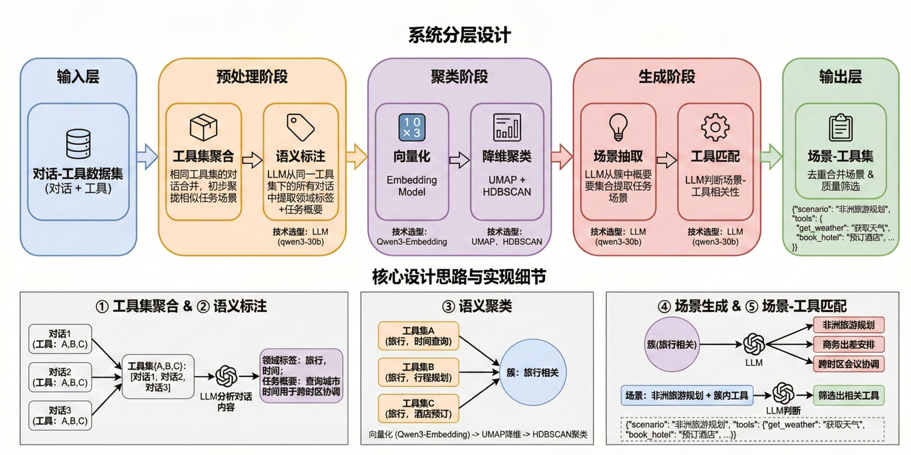

# Awesome-Plan2Exec
[English](README_en.md) | [中文](README.md)

## Introduction

The ultimate goal of this project is to **train a Planning Agent** capable of generating structured, reasonable task plans given a toolset and user query.

To achieve this, we designed a complete data construction pipeline with two progressive stages:

1. **Scenario-Toolset Construction** (`scenario-toolset-generator/`): Automatically mine "Task Scenario → Toolset" mappings from conversation data
2. **Preference Data Synthesis** (`plan-data-synthesis/`): Synthesize preference training data based on upstream scenario-toolset outputs


## Project Structure

```
Awesome-Plan2Exec/
├── scenario-toolset-generator/    # Stage 1: Scenario-Toolset Generator
│   ├── data/                      # Raw data
│   ├── preprocess/                # Stage 1.1: Preprocessing: merge, annotate, embed
│   ├── embeddings/                # Stage 1.2: Vector storage
│   ├── clustering/                # Stage 1.3: Clustering results
│   ├── generate/                  # Stage 1.4: Scenario generation
│   └── output/                    # Stage 1.5: Generate a "Scenario → Toolset" dataset.
├── plan-data-synthesis/           # Stage 2: Preference Data Synthesis
│   ├── config.py                  # Centralized config (LLM, concurrency, sampling)
│   ├── utils.py                   # Shared utilities (LLM calls, JSON parsing)
│   ├── generate_questions.py      # Stage 2.1: Multi-difficulty question generation
│   ├── plan_sampling.py           # Stage 2.2: Multi-path plan sampling
│   ├── evaluate_plans.py          # Stage 2.3: LLM-as-Judge evaluation
│   ├── build_preference.py        # Stage 2.4: Preference data extraction
│   ├── run_pipeline.py            # Entry script (chains all 4 stages)
│   ├── test/                      # Tests (pytest + hypothesis property tests)
│   └── output/                    # Stage output files
├── images/                        # Image resources
├── requirements.txt               # Python dependencies
├── README_en.md
└── README.md
```

## Installation

```bash
pip install -r requirements.txt
```

---

## Stage 1: Scenario-Toolset Construction

> Directory: `scenario-toolset-generator/`

### Goal

Automatically construct "Task Scenario → Toolset" mappings from conversation data for tool recommendation, agent task planning, and multi-tool orchestration.

### Core Pipeline

1. **Toolset Aggregation**: Merge conversations sharing the same toolset
2. **Semantic Annotation**: LLM extracts domain labels and task summaries
3. **Semantic Clustering**: Embedding + UMAP + HDBSCAN discovers similar toolset clusters
4. **Scenario Generation**: LLM extracts concrete task scenarios from each cluster
5. **Tool Matching**: LLM determines scenario-tool relevance, filters relevant tool subsets



### Technology Stack

| Component | Choice | Purpose |
|-----------|--------|---------|
| LLM | Qwen3-30B-A3B-Instruct-2507 | Semantic understanding, label extraction, scenario generation |
| Embedding | Qwen3-Embedding-4B | Label vectorization |
| Dimensionality Reduction | UMAP | Preserve semantic structure |
| Clustering | HDBSCAN | Automatic cluster discovery |

### Running

```bash
cd scenario-toolset-generator

# 1. Download raw data
wget -P data -O graphsyn.jsonl https://www.modelscope.cn/datasets/nanbeige/ToolMind/resolve/master/graph_syn_datasets/graphsyn.jsonl

# 2. Merge by toolset
python preprocess/merge_by_toolset.py

# 3. LLM label extraction (requires local LLM service)
python preprocess/extract_labels.py

# 4. Label embedding (requires local Embedding service)
python preprocess/embed_labels.py

# 5. Clustering
python clustering/cluster_labels.py

# 6. Group by cluster
python generate/group_by_cluster.py

# 7. Extract scenarios
python generate/extract_scenarios.py

# 8. Scenario-tool matching
python output/match_scenario_tools.py

# 9. Deduplicate and merge
python output/merge_duplicate_scenarios.py
```

### Output

- `output/scenario_tools_gte10.jsonl` — Scenarios with ≥10 tools (4,329 records)
- `output/scenario_tools_lt10.jsonl` — Scenarios with <10 tools (169 records)

**Output Example:**
```json
{
  "scenario": "African Travel Planning",
  "tools": {
    "get_weather": "Get destination weather information",
    "book_hotel": "Book hotels",
    "search_flights": "Search for flights"
  },
  "tools_count": 15
}
```

### Data Statistics

| Stage | Count |
|-------|-------|
| Raw Conversations | 163,180 |
| Unique Toolsets | 23,183 |
| Clusters | 467 |
| Generated Scenarios | 4,701 |
| Final Output (≥10 tools) | 4,329 |

---

## Stage 2: Preference Data Synthesis

> Directory: `plan-data-synthesis/`

### Goal

Built on top of the upstream scenario-toolset data, this module runs a four-stage pipeline — Question Generation → Plan Sampling → LLM-as-Judge Evaluation → Preference Data Extraction — to produce preference training data for planning agent alignment.

### Prerequisites

- Completed Stage 1 with `scenario-toolset-generator/output/scenario_tools_gte10.jsonl`
- An available LLM API service (OpenAI-compatible format)

### Core Workflow

Preference data synthesis follows a four-stage pipeline, with explicit structural constraints and filtering rules at each step:

1. **Question Generation (`generate_questions.py`)**
  - Select 13 representative scenarios from Stage 1 data (covering multiple domains and toolset sizes), and generate 4 fixed question types per scenario:
    - `simple`: solvable with a single tool
    - `parallel`: 2-3 tools with parallel, non-dependent subtasks
    - `complex_dependency`: multi-step tasks with strong dependency chains
    - `chat`: scenario-related questions that require no tool usage

2. **Plan Sampling (`plan_sampling.py`)**
  - Perform multiple stochastic samplings per question to produce diverse candidate plans for the same query.
  - Apply structural validity checks to filter out plans with missing fields or invalid dependency relations.

3. **Automatic Evaluation (`evaluate_plans.py`)**
  - Use LLM-as-Judge to score each plan on five dimensions: tool accuracy, dependency logic, task completeness, planning efficiency, and thought quality.
  - Aggregate dimension scores with fixed weights to ensure consistent scoring criteria across samples.

4. **Preference Construction (`build_preference.py`)**
  - Rank plans per question by total score and form preference pairs from higher-scored vs. lower-scored candidates.
  - Enforce constraints on minimum score gap, structural validity, and plan-level diversity to avoid weak or pseudo preference pairs.

### Configuration

First, copy the config template and fill in your LLM settings:

```bash
cd plan-data-synthesis
cp config_example.py config.py
```

Then edit `config.py` with your LLM configuration:

```python
LLM_BASE_URL = "your-llm-api-url"  # Your LLM API endpoint
LLM_MODEL = "model-name"                      # Model name
LLM_API_KEY = "your-api-key"                 # API Key
```

### Running

```bash
cd plan-data-synthesis

# Run the full pipeline
python run_pipeline.py

# Resume from a specific stage
python run_pipeline.py --start-stage 2

# Or run individual stages
python generate_questions.py    # Stage 1: Question generation
python plan_sampling.py         # Stage 2: Plan sampling
python evaluate_plans.py        # Stage 3: LLM evaluation
python build_preference.py      # Stage 4: Preference extraction
```

### Output

| File | Description |
|------|-------------|
| `output/questions.jsonl` | ~50 multi-difficulty user questions |
| `output/plan_samples.jsonl` | Multiple sampled plans per question |
| `output/evaluated_plans.jsonl` | Five-dimension evaluation scores |
| `output/preference_data.jsonl` | Final preference training data |

### Testing

```bash
cd plan-data-synthesis
python -m pytest test/ -v
```

---

## License

Apache-2.0
