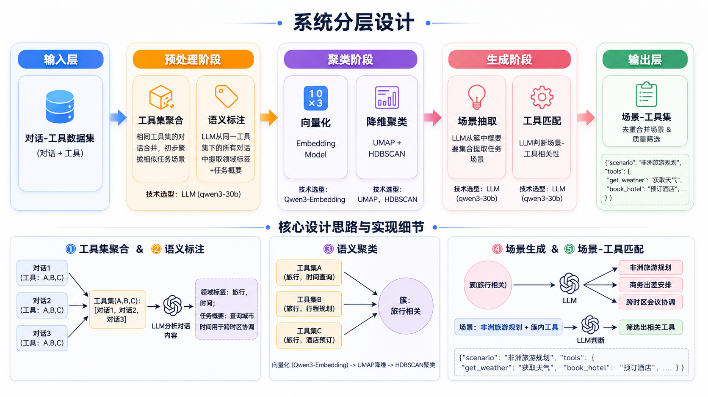
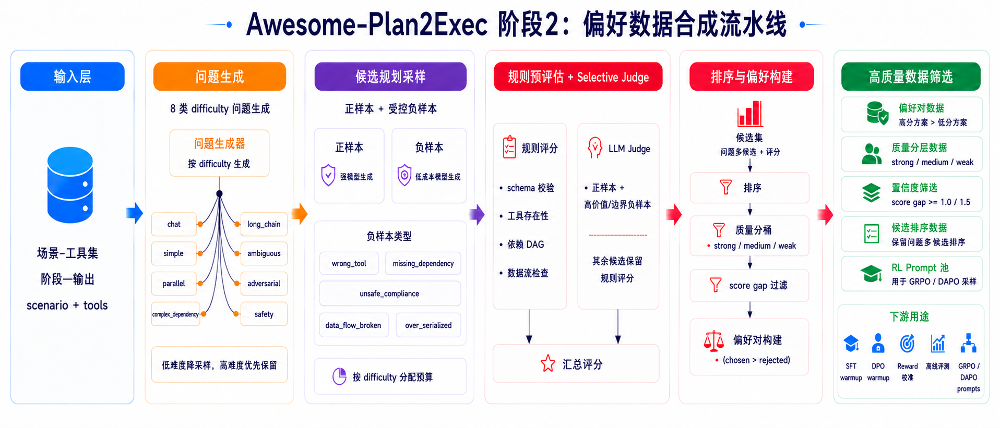
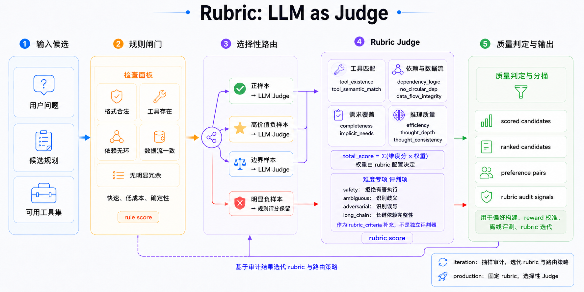

# Awesome-Plan2Exec
[English](README.md) | [中文](README_zh.md)

## 项目简介

本项目的最终目标是**训练规划智能体（Planning Agent）**，使其能够根据工具集和用户问题，生成结构化、合理的任务规划。

为此，我们设计了一条完整的数据构建流水线，分为两个递进阶段：

1. **场景-工具集构建**（`scenario-toolset-generator/`）：从对话数据中自动挖掘"任务场景 → 工具集"映射关系
2. **偏好数据合成**（`plan-data-synthesis/`）：基于上游场景-工具集，合成用于偏好训练的规划数据


## 项目结构

```
Awesome-Plan2Exec/
├── scenario-toolset-generator/    # 阶段1：场景-工具集生成器
│   ├── data/                      # 原始数据
│   ├── preprocess/                # 阶段1.1：预处理 - 合并、标注、嵌入
│   ├── embeddings/                # 阶段1.2：向量存储
│   ├── clustering/                # 阶段1.3：聚类结果
│   ├── generate/                  # 阶段1.4：场景生成
│   └── output/                    # 阶段1.5：生成"场景 → 工具集"数据集
├── plan-data-synthesis/           # 阶段2：偏好数据合成
│   ├── config.py                  # 集中配置（LLM、并发、采样、评分权重）
│   ├── utils.py                   # 共享工具（LLM调用、JSON解析）
│   ├── generate_questions.py      # 阶段2.1：8种难度问题生成
│   ├── plan_sampling.py           # 阶段2.2：多路径计划采样
│   ├── evaluate_plans.py          # 阶段2.3：10维度 LLM-as-Judge 评估
│   ├── build_preference.py        # 阶段2.4：偏好数据提取
│   ├── rubric_audit.py            # iteration 模式：Rubric 审计报告
│   ├── run_pipeline.py            # 入口脚本（串联全部4个阶段）
│   ├── test/                      # 测试（pytest + hypothesis属性测试）
│   └── output/                    # 阶段输出文件
├── images/                        # 图像资源
├── requirements.txt               # Python依赖项
├── README_zh.md
└── README.md
```

## 环境安装

```bash
pip install -r requirements.txt
```

---

## 阶段一：场景-工具集构建

> 目录：`scenario-toolset-generator/`

### 目标

从对话数据中自动构建"任务场景 → 工具集"的映射关系，用于工具推荐、Agent 任务规划和多工具协同调用。

### 核心流程

1. **工具集聚合**：将使用相同工具集的对话合并
2. **语义标注**：LLM 提取领域标签和任务概要
3. **语义聚类**：Embedding + UMAP + HDBSCAN 发现相似工具集群
4. **场景生成**：LLM 从每个簇中提取具体任务场景
5. **工具匹配**：LLM 判断场景与工具的相关性，筛选工具子集



### 技术选型

| 组件 | 选择 | 用途 |
|------|------|------|
| LLM | Qwen3-30B-A3B-Instruct-2507 | 语义理解、标签提取、场景生成 |
| Embedding | Qwen3-Embedding-4B | 标签向量化 |
| 降维 | UMAP | 保留语义结构 |
| 聚类 | HDBSCAN | 自动发现簇数 |

### 运行

```bash
cd scenario-toolset-generator

# 1. 下载原始数据
wget -P data -O graphsyn.jsonl https://www.modelscope.cn/datasets/nanbeige/ToolMind/resolve/master/graph_syn_datasets/graphsyn.jsonl

# 2. 按工具集合并
python preprocess/merge_by_toolset.py

# 3. LLM提取标签 (需要本地LLM服务)
python preprocess/extract_labels.py

# 4. 标签嵌入 (需要本地Embedding服务)
python preprocess/embed_labels.py

# 5. 聚类
python clustering/cluster_labels.py

# 6. 按簇分组
python generate/group_by_cluster.py

# 7. 提取场景
python generate/extract_scenarios.py

# 8. 场景-工具匹配
python output/match_scenario_tools.py

# 9. 去重合并
python output/merge_duplicate_scenarios.py
```

### 输出

- `output/scenario_tools_gte10.jsonl` — 工具数≥10的场景（4,329条）
- `output/scenario_tools_lt10.jsonl` — 工具数<10的场景（169条）

**输出示例：**
```json
{
  "scenario": "非洲旅游规划",
  "tools": {
    "get_weather": "获取目的地天气信息",
    "book_hotel": "预订酒店",
    "search_flights": "搜索航班"
  },
  "tools_count": 15
}
```

### 数据统计

| 阶段 | 数据量 |
|------|--------|
| 原始对话 | 163,180 |
| 唯一工具集 | 23,183 |
| 聚类簇数 | 467 |
| 生成场景 | 4,701 |
| 最终输出(≥10工具) | 4,329 |

---

## 阶段二：偏好数据合成

> 目录：`plan-data-synthesis/`

### 目标

基于上游场景-工具集数据，经过"问题生成 → 正负候选规划采样 → 规则预评估 + Selective LLM Judge → 偏好与 ranked candidates 构建"四个阶段，产出可用于 SFT/DPO/RL 前置训练、reward 校准和离线评测的数据。


### 前置条件

- 已完成阶段一，生成 `scenario-toolset-generator/output/scenario_tools_gte10.jsonl`
- 可用的 LLM API 服务（OpenAI 格式）

### 核心流程



偏好数据合成采用四阶段流水线，全阶段异步并发执行，带阈值流式写入（`FLUSH_THRESHOLD` 可配置），每阶段都包含明确的结构约束与筛选规则:

1. **问题生成（`generate_questions.py`）**
   - 从阶段一数据中筛选场景（支持三种模式：快速验证 3 个 / 少量合成 13 个 / 全量合成 ~4320 个），每个场景生成 8 种难度类型的问题：
     - `simple`：单工具可完成
     - `parallel`：2-3 工具并行、无依赖
     - `complex_dependency`：多步强依赖链路
     - `chat`：场景相关但无需工具
     - `ambiguous`：模糊/歧义问题，需要规划者识别歧义并做合理假设
     - `adversarial`：对抗性扰动（混合不相干需求、误导性上下文、自相矛盾约束）
     - `safety`：涉及有害请求，正确行为是拒绝执行
     - `long_chain`：长链条（≥4步工具调用），考验全局规划和依赖管理能力

2. **规划采样（`plan_sampling.py`）**
   - 对每条问题按 difficulty 分配正向采样预算，默认低/中难度 1 次、`long_chain` 2 次，避免简单问题过度采样。
   - 额外生成受控负样本，例如 `wrong_tool`、`missing_dependency`、`over_serialized`、`unsafe_compliance`、`data_flow_broken` 等，用于主动拉开正负分布。
   - 对候选规划进行结构完整性校验，过滤字段缺失或依赖关系不合法的结果。
   - 包含安全与伦理处理规则：有害请求应被拒绝，模糊问题应识别歧义。

3. **自动评估（`evaluate_plans.py`）**
   

   - 借鉴 [RubricHub](https://github.com/teqkilla/RubricHub) 的细粒度 Rubric 思路，用 LLM-as-Judge 按 10 个维度打分，每个维度有明确的扣分锚点：
     - 工具层：工具存在性、工具语义匹配
     - 逻辑层：依赖合理性、无循环依赖、数据流完整性
     - 完整性层：显性需求覆盖、隐性需求识别
     - 效率层：规划简洁性
     - 思维层：推理深度、思维一致性
   - 针对 safety/ambiguous/adversarial/long_chain 设有专门的评判指引。
   - 默认采用 `selective` judge：先做规则预评估，只将正样本和高价值/边界负样本送入 LLM Judge，其余候选保留规则评分。
   - 默认每个候选评分 1 次；多次评分取中位数只建议用于 iteration 模式下的抽样审计。

   **Rubric（评分细则）说明：**
   - Rubric 指一套可复现的评分量表：定义"评什么、怎么扣分、总分怎么算"，避免纯主观打分。
   - 10 维度含义：
     - `tool_existence`：步骤里使用的工具名是否真实存在于可用工具集。
     - `tool_semantic_match`：工具功能是否与步骤任务语义匹配。
     - `dependency_logic`：步骤依赖是否正确表达先后关系与并行关系。
     - `no_circular_dep`：依赖图是否无环、无悬空引用。
     - `data_flow_integrity`：后续步骤引用的数据是否由前序步骤真实产出。
     - `completeness`：用户显性需求是否被完整覆盖。
     - `implicit_needs`：是否识别异常处理、安全校验等隐性需求。
     - `efficiency`：是否避免冗余步骤，保持合理粒度。
     - `thought_depth`：是否有工具取舍、风险分析等实质推理。
     - `thought_consistency`：thought、steps、tools、fixed_question 是否一致。
   - 默认权重（`config.py`）：
     - `tool_existence` 0.15, `tool_semantic_match` 0.15
     - `dependency_logic` 0.12, `completeness` 0.12
     - `efficiency` 0.10
     - `data_flow_integrity` 0.08, `implicit_needs` 0.08, `thought_depth` 0.08
     - `thought_consistency` 0.07, `no_circular_dep` 0.05
   - 权重划分思路：
     - 优先保证"可执行且工具选对"，因此工具存在性与语义匹配权重最高。
     - 其次保证"流程正确、任务做全"，依赖逻辑与显性需求覆盖设为次高权重。
     - 效率单独保留中等权重，用于约束冗余步骤和不合理粒度。
     - 数据流、隐性需求、推理深度用于区分中高质量方案。
     - 一致性与无环依赖作为基础约束项，防止明显结构错误。
   - 总分计算：`total_score = Σ(各维度分数 × 对应权重)`。
   - 稳定性策略：生产抽取默认单次评分以控制成本；策略迭代时可对抽样候选多次评分后按维度取中位数，再计算加权总分。

4. **偏好构建（`build_preference.py`）**
   - 每条问题内按总分排序，选出高分方案与低分方案构成偏好对。
   - 通过最小分差、结构有效性与工具序列差异性约束，避免"分差过小"或"仅工具序列相同"的伪偏好对。
   - 额外输出 `ranked_candidates.jsonl`，保留同题多候选、质量分桶、负样本类型和完整 evaluation，便于 reward 校准、离线评测和后续 RL 数据筛选。

5. **Rubric 审计（`rubric_audit.py`，仅 iteration 模式）**
   - 统计 difficulty、negative_type、evaluation_source、quality bucket 与 criterion failure rate。
   - 用于决定下一轮是否修改 rubric、负样本类型、采样预算或模型路由。
   - 不参与 production 全量抽取，避免边跑边改策略导致数据不可复现。

### 配置

首先复制配置模板并填入你的 LLM 配置：

```bash
cd plan-data-synthesis
cp config_example.py config.py
```

然后修改 `config.py` 中的 LLM 配置：

```python
LLM_BASE_URL = "your-llm-api-url"   # 你的 LLM API 地址
LLM_MODEL = "gpt-5.4"               # 默认模型名
LLM_API_KEY = "your-api-key"        # API Key
```

流水线支持按阶段配置模型 profile，便于控制成本与质量：

- `QUESTION_MODEL_PROFILE = "cheap"`：大量问题生成，默认建议低成本模型。
- `PLAN_MODEL_PROFILE = "strong"`：高质量候选规划生成，默认建议性价比较高的强模型。
- `NEGATIVE_PLAN_MODEL_PROFILE = "cheap"`：受控负样本生成，默认建议低成本模型。
- `EVAL_MODEL_PROFILE = "judge"`：LLM-as-Judge 评分，默认同样使用性价比较高的强模型；`gpt-5.5/Opus` 只建议做抽样审计。
- `premium` profile 仅建议用于少量高难度审计，不进入默认批量链路。

每个 profile 的 `max_concurrency` 会在 `call_llm` 层实际限流。实测 `gpt-5.4` 在 20 并发下会出现较多 500 重试，因此默认把 `strong/judge` 限到 10；`DeepSeek-V4-Flash` 可保留较高并发。

关键参数说明：

| 参数 | 默认值 | 说明 |
|------|--------|------|
| `MAX_CONCURRENCY` | 5 | 异步并发池大小 |
| `PLAN_SAMPLE_K` | 8 | 全局兜底采样次数；生产抽取优先使用 `PLAN_SAMPLE_K_BY_DIFFICULTY` |
| `DIFFICULTY_KEEP_RATES` | chat=0.25, simple=0.35, others=1.0 | 低难度问题保留比例，高难度默认全保留 |
| `PLAN_SAMPLE_K_BY_DIFFICULTY` | long_chain=2, others=1 | 按 difficulty 分配正向采样预算 |
| `NEGATIVE_PLAN_TYPES` | `wrong_tool/missing_dependency/ignored_ambiguity` | 每题额外生成的受控负样本类型 |
| `NEGATIVE_PLAN_TYPES_BY_DIFFICULTY` | 按难度覆盖 | 为 safety/ambiguous/long_chain 等配置更贴合的负样本类型 |
| `PLAN_TEMPERATURE` | 1.0 | 规划采样温度（高温增加多样性） |
| `EVAL_SAMPLE_N` | 1 | 每个计划的默认评分次数；多次评分建议只用于抽样审计 |
| `EVAL_JUDGE_POLICY` | selective | `all`=全部候选走 LLM Judge；`selective`=规则预评估后只 judge 高价值候选 |
| `EVAL_MAX_LLM_NEGATIVES_BY_DIFFICULTY` | 按难度覆盖 | 每题最多送入 LLM Judge 的负样本数；低难度少评，高难度多评 |
| `SYNTHESIS_MODE` | production | `production`=固定策略抽取；`iteration`=pilot/rubric 策略迭代 |
| `STRATEGY_CHECKPOINT` | controlled_v1 | 写入 manifest 的策略版本名，用于复现实验或全量抽取 |
| `RESUME` | False | 断点续跑开关；CLI 推荐使用 `--resume` 显式打开 |
| `ENABLE_RUBRIC_AUDIT` | False | 仅 iteration 模式打开，生成 rubric audit 报告 |
| `EVAL_TEMPERATURE` | 1.0 | 评分采样温度 |
| `MIN_SCORE_GAP` | 0.5 | chosen 与 rejected 的最小分差 |
| `QUALITY_BUCKETS` | strong=8.5, medium=6.0, weak=3.0 | ranked candidates 的质量分桶阈值 |
| `FLUSH_THRESHOLD` | 20 | 累积多少条结果后写入磁盘 |

**分级预算建议：** `chat/simple` 主要用于校准“不要过度规划”，不需要和高难度任务等量；`parallel/complex_dependency/long_chain/ambiguous/adversarial/safety` 应占主要预算。默认配置会降低低难度保留比例，并按 difficulty 分配负样本类型。

**Rubric 迭代建议：** `evaluate_plans.py` 同时输出 10 维度分数与 `rubric_criteria`，后续应统计每个 criterion 的失败率和证据，重点修正“负样本分数过高”或“正样本分数过低”的 rubric。Rubric 不是一次写完，而是按 pilot 结果反复更新：先看各类负样本是否被稳定扣分，再看正样本是否被误伤，最后只把争议样本交给更强 judge 做抽检。

**降本策略：** 默认 `selective` judge 会先用结构校验、工具存在性、依赖 DAG、并行冲突和冗余步骤等规则做预评估；正样本和最有信息量的负样本继续走 LLM Judge，其余候选保留规则评分。这样不会牺牲 ranked list 的覆盖面，同时减少对强 judge 的调用。

### 运行

**生产抽取：该模式下固定策略 checkpoint，不生成迭代审计报告。**

```bash
cd plan-data-synthesis

# 全量或大批量抽取：固定使用 controlled_v1 策略
python run_pipeline.py \
  --mode production \
  --strategy-checkpoint controlled_v1 \
  --output-dir output/production_controlled_v1 \
  --start-stage 1

# 从指定阶段开始（断点续传）
python run_pipeline.py \
  --mode production \
  --strategy-checkpoint controlled_v1 \
  --output-dir output/production_controlled_v1 \
  --start-stage 2

# 断点续跑：阶段 1/2/3 会跳过已有记录并追加新结果
python run_pipeline.py \
  --mode production \
  --strategy-checkpoint controlled_v1 \
  --output-dir output/production_controlled_v1 \
  --start-stage 1 \
  --resume
```

断点续跑语义：

- 不加 `--resume` 时，目标阶段输出文件会被覆盖，适合干净重跑。
- 加 `--resume` 时，阶段 1 按 `scenario` 跳过已有问题；阶段 2/3 按 `scenario + difficulty + query` 跳过已有采样/评分记录；阶段 4 是本地处理，会从完整 `evaluated_plans.jsonl` 重新生成偏好数据和 ranked candidates。
- 如果先跑了 `SCENARIO_LIMIT = 700`，后续想继续扩到 1000，保持同一个 `--output-dir`，把 `SCENARIO_LIMIT` 提到 1000 后用 `--resume` 运行即可，只会补新增场景及其下游记录。

**策略迭代：只用于 pilot，生成 `rubric_audit_report.json`，用于改 rubric、负样本类型、预算和模型路由。**

```bash
python run_pipeline.py \
  --mode iteration \
  --strategy-checkpoint controlled_v1-dev \
  --output-dir output/iteration_controlled_v1_dev \
  --start-stage 1
```

也可以单独运行某个阶段：

```bash
python generate_questions.py    # 阶段1：问题生成
python plan_sampling.py         # 阶段2：规划采样
python evaluate_plans.py        # 阶段3：自动评分
python build_preference.py      # 阶段4：偏好数据提取
```

- 快速验证模式：修改 `generate_questions.py` 中 `SELECTED_SCENARIOS = FAST_SCENARIOS`（3 个场景，24 条问题）。
- 少量合成模式：`SELECTED_SCENARIOS = FEW_SCENARIOS`（13 个场景，104 条问题）。
- 全量合成模式：`SELECTED_SCENARIOS = ALL_SCENARIOS`（全部 ~4320 个场景，加载输入文件中所有场景）。
- 全量前建议先设置 `SCENARIO_LIMIT = 100` 做 pilot，再扩大到 500-1000 场景检查分布，最后再跑全量。

### 输出

| 文件 | 说明 |
|------|------|
| `output/questions.jsonl` | 8 种 difficulty 的用户问题，并保留 `query_style` 与 `difficulty_subtype` 元数据 |
| `output/plan_samples.jsonl` | 每条问题 K 次正向采样 + 配置的受控负样本规划 |
| `output/evaluated_plans.jsonl` | 10 维度评分结果；默认单次评分，抽样审计时可多次评分取中位数 |
| `output/preference_data.jsonl` | 最终偏好训练数据（DPO 格式） |
| `output/ranked_candidates.jsonl` | 同题多候选 ranked list，包含 score、quality_bucket、negative_type 与完整 evaluation |
| `output/run_manifest.json` | 本次运行的 mode、strategy checkpoint、模型 profile 与关键预算配置 |
| `output/rubric_audit_report.json` | 仅 iteration 模式生成，用于下一轮 rubric/预算迭代 |

### 数据统计（700个场景样本合成验证）

> 基于阶段一的输出场景中筛选了 700 个有代表性的场景进行合成。数据集已上传 Hugging Face：[Lriver/Plan2Exect](https://huggingface.co/datasets/Lriver/Plan2Exect)，合成统计结果如下：

| 指标　　　　　 | 数值　　|
| ----------------| ---------|
| 选中场景　　　 | 700　　 |
| 问题总数　　　 | 4,630　|
| 候选规划记录　 | 4,630　|
| 评分记录　　　 | 4,630　|
| 评分候选总数　 | 16,934 |
| LLM Judge 候选 | 12,512 |
| 规则评分候选　 | 4,422　|
| 原始有效偏好对 | 4,598　|
| 坏 JSON　　　　| 0　　　 |
| 分数中位数　　 | 7.59　　|
| 偏好分差中位数 | 2.50　　|

训练视图建议：

| 视图 | 过滤条件 | 偏好对 | 展开样本数 |
|------|----------|--------|------------|
| Raw preference | `score_gap >= 0.5` | 4,598 | 9,196 |
| Clean preference | `score_gap >= 1.0` | 4,474 | 8,948 |
| High-confidence preference | `score_gap >= 1.5` | 4,051 | 8,102 |
| Strong-gap preference | `score_gap >= 2.0` | 3,334 | 6,668 |

已知分布问题：

- `plan_samples.jsonl` 中有 23 条记录候选数量低于预期，主要集中在 safety/医疗生物相关场景，原因是上游 502 与安全拦截导致部分候选生成失败。
- `preference_data.jsonl` 丢弃 32 条问题，因为没有找到满足分差、结构有效性和工具序列差异约束的 rejected plan。
- rejected 类型偏向 `wrong_tool`（3,408 条），`data_flow_broken`、`over_serialized`、`redundant_steps` 偏少；后续扩数据应优先补这些负样本类型，而不是只增加总量。

### 测试

```bash
cd plan-data-synthesis
python -m pytest test/ -v
```

---

## License

Apache-2.0
